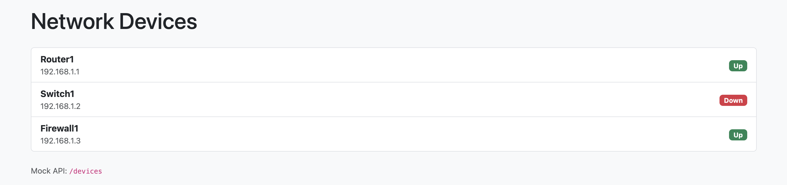

# NRE — Devices Dashboard

## Project Preview

A README file with only the essentials: how to set up, run, and test the project.

## Prerequisites

- Python 3.10+
- Recommended: create a virtual environment

## Run locally with Docker

1. Clone:
   git clone https://github.com/your-username/nre_project.git

   cd nre_project

2. Make entrypoint executable (once):

   chmod +x entrypoint.sh

3. Build & start:

   docker compose up --build

4. Open in browser:

   http://127.0.0.1:8000/ -> Dashboard

   http://127.0.0.1:8000/devices -> Devices List

5. Stop:

   docker compose down

6. Run tests:

   docker compose run --rm web pytest -q

## Manual Setup (one-time)

From the project root (where `manage.py` lives):

# 1. Create & activate virtualenv

python -m venv venv

# mac / linux

source venv/bin/activate

# windows (PowerShell)

.\venv\Scripts\Activate.ps1

# 2. Install dependencies

pip install -r requirements.txt

If you don't have a `requirements.txt`, run:

pip install Django requests pytest pytest-django

pip freeze > requirements.txt

## Run the app

# apply migrations (safe even if there are no models)

python manage.py migrate

# start development server

python manage.py runserver

Open: `http://127.0.0.1:8000/` → dashboard

API endpoint: `http://127.0.0.1:8000/devices` → JSON

## Run tests (pytest)

From project root:

- Run entire test suite:

pytest -q

- Run a single test function:

pytest devices/tests/test_services.py::test_fetch_devices_success -q -s

- Run all tests in an app/folder:

pytest devices/tests/

- Run tests by name pattern:

pytest -k "fetch_devices"

(You can also use `python manage.py test <dotted-path>` to run tests with Django test runner if preferred.)

## Quick troubleshooting

- If you see `TemplateDoesNotExist: devices/dashboard.html`:

  - Ensure template file exists at `devices/templates/devices/dashboard.html`.
  - Ensure `devices` is listed in `INSTALLED_APPS` in `nre_project/settings.py`.
  - Ensure `TEMPLATES` in settings has `"APP_DIRS": True`.

## Helpful commands (cheat sheet)

# activate venv

mac/linux

source venv/bin/activate

windows

.\venv\Scripts\Activate.ps1

# run server

python manage.py migrate

python manage.py runserver

# run tests

pytest -q

pytest devices/tests/test_views.py::test_dashboard_shows_devices_when_fetch_succeeds -q -s
